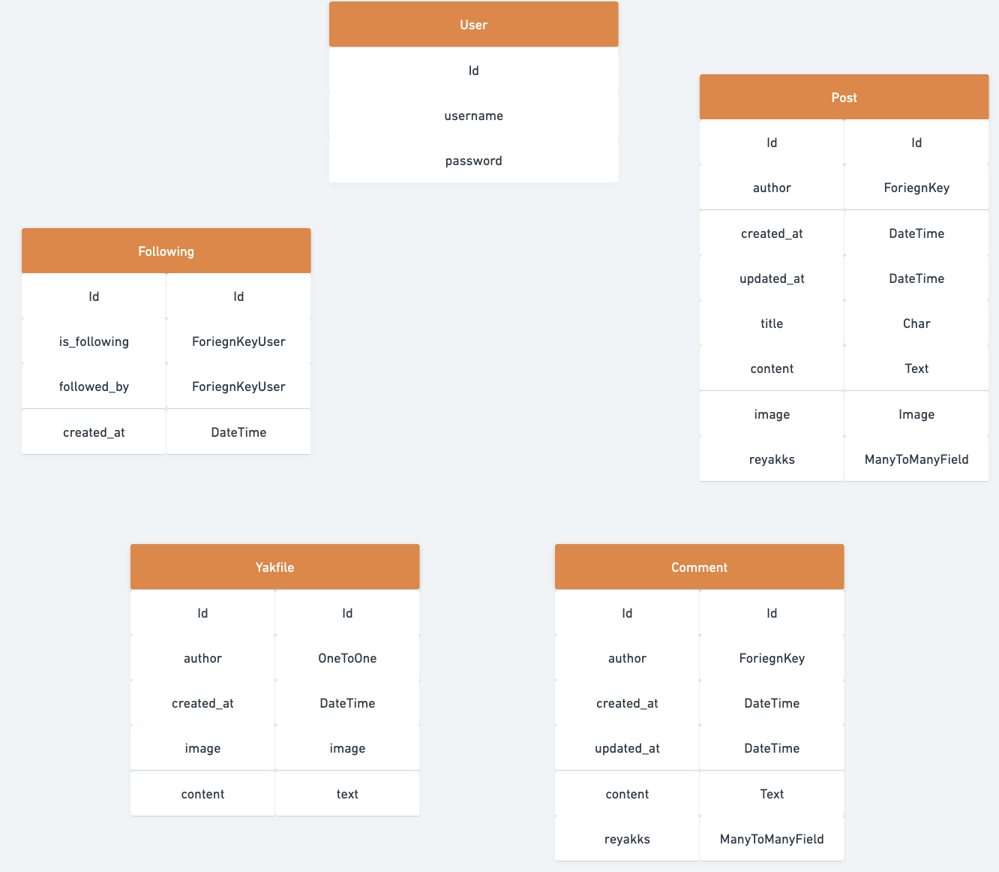

# Yakker - Back-End

Yakker is a social-media website designed to mimic the features of Twitter. Users can create an account, login, make a post, make comments on posts, like (reyakk) to other user's posts and comments, change their profile (yakfile) photo and profile biography. Yakker is designed to allow users to make posts about whatever they want, and be able to engage with other users by commenting on other posts and reyakking to posts. This repository contains the back-end API portion of Yakker, created with Django REST Framework.

## Deployed Link

- [Yakker Back-End Deployed Link](https://yakker-backend.herokuapp.com/)

## Front-End Links

- [Yakker Front-End Deployed Link](https://yakker-front-end.herokuapp.com/)
- [Yakker Front-End GitHub](https://github.com/lee-joanne/yakker-frontend/)

## User Experience (UX)

### User Stories

- Users: 

    - Authentication

        1. As a **user** I **cannot edit/delete posts/comments/likes that are not mine** so that **I can be assured that my posts/comments/likes are protected and can only be changed by me.**

            - This is user story is achieved by creating custom permissions that will stop users from deleting, editing, unliking/liking posts/comments that are not done by themselves.

        2. As a **user** I can **see whether I am logged in or not** so that **I will know if I will need to log in if I am not.**

            - This user story is achieved by showing the username created in Yakfile after user signs up and logins using Django's all-auth.

        3. As a **user** I can **sign up easily with just a username and password** so that **I have the ability to create posts or comments without having to share my email address.**

            - This user story is achieved by using Django's all-auth.

        4. As a **user** I can **easily log out** so that **I can have more security on my account.**

            - This user story is achieved by using Django's all-auth.

        5. As a **user** I can **easily log in** so that **I can quickly post, add more comments, or delete content if I wish.**

            - This user story is achieved by using Django's all-auth.
        
        6. As a **user** I can **only like/unlike other users' posts and comments** so that **I can only show my appreciation for other posts/comments and not cheat the system by liking my own posts/comments.**

            - This user story is achieved by creating the Comment Reyakks and Post Reyakks models. Custom permissions is created to allow users to only like other user's posts/comments.

        7. As a **user** I can **only follow other users** so that **I cannot cheat the system and follow myself and gain myself a new, false follower.**

            - This user story is achieved by creating the Follower model. Custom permission is created to stop users from following themselves.

    - Posts

        1. As a **user** I can **create new posts** so that **I can share images, my thoughts, or what I'm doing.**

            - This user story is achieved by creating the Post model. Users can add images, content, and a title to posts.

        2. As a **user** I can **edit posts** so that **I can change my posts, images, etc whenever I change my mind about what I posted or wish to remove/add details.**

            - This user story is achieved by using generics.RetrieveUpdateDestroyAPIView in Post views. Users are able to edit their posts. 

        3. As a **user** I can **delete my posts** so that **I can get rid of my posts that I no longer want to be shared.**

            - This user story is achieved by using generics.RetrieveUpdateDestroyAPIView in Post views. Users are able to delete their posts. 

        4. As a **user** I can **view the details of a post** so that **I can read more information about the post such as when it was created, who created it, if it was edited, read the comments, etc.**

            - This user story is achieved by using generics.RetrieveUpdateDestroyAPIView in Post views. Users are able to see detailed information about a post such as who created it, when it was created/edited, if there are comments, etc. 

        5. As a **user** I can **like posts** so that **I can share my appreciation for the post and show the world and the author that their post is great.**

            - This user story is achieved using the Post Reyakks model. Users are able to reyakk to user posts.

        6. As a **user** I can **remove likes on a post** so that **I can change my mind about whether I like the post or not.**

            - This user story is achieved using generics.RetrieveDestroyAPIView in Post Reyakks views. Users are able to remove their reyakks on a post.

    - Comments

        1. As a **user** I can **post a comment on a post** so that **I can contribute discussion to a post or share my thoughts about a post.**

            - This user story is achieved using the Comment model. Users are able to create comments on posts.

        2. As a **user** I can **delete my comments on a post** so that **I can remove comments if I no longer want my comments to be public.**

            - This user story is achieved using generics.RetrieveUpdateDestroyAPIView in Comment views. Users are able to delete their comments. 

        3. As a **user** I can **read comments on a post** so that **I can read what others think about the post and read the discussion happening.**

            - This user story is achieved using generics.ListCreateAPIView in Comment views. Users are able to read the list of comments on a post. 

        4. As a **user** I can **edit my comments** so that **have the possibility to remove or add more details to my existing comments.**

            - This user story is achieved using generics.RetrieveUpdateDestroyAPIView in Comment views. Users are able to edit their comments. 

        5. As a **user** I can **like comments** so that **I can share my appreciation for the comment.**

            - This user story is achieved by creating the Comment Reyakks model. Users are able to reyakk to other user's comments.

        6. As a **user** I can **unlike comments** so that **I can change my mind about my positive feelings towards a comment.**

            - This user story is achieved using generics.RetrieveDestroyAPIView in Comment Reyakks views. Users are able to remove their reyakks on a post.

    - Profile

        1. As a **user** I can **follow or unfollow other users** so that **I can see or choose to remove posts by specific users in my posts feed.**
        
            - This user story is achieved using the Follower model. Users are able to follow and unfollow other users. 

        2. As a **user** I can **view a detailed page of users** so that **I can see their posts and learn more about the user. I can also see their following count, followers count, etc.**

            - This user story is achieved using the Yakfile views. Users are able to see posts tied to a user, including their following count and followers count.

        3. As a **user** I can **view user avatars** so that **easily identify users of the website.**

            - This user story is achieved by the Yakfile model, allowing users to add in images to their profiles. 

    - Errors

        1. As a **user** I can **view a nice 500 page in the API** so that **I can be informed whether the server or database is having an issue on a nice, user-friendly interface.**

            - This user story is achieved by creating custom views to throw a 500 page in a readable format when the server or database is having an issue.

        2. As a **user** I can **see a nice 404 page in the API** so that **I know if I have reached a webpage that does not exist on a more user-friendly interface.**

            - This user story is achieved by creating custom views to throw a 404 page in a readable format when a link or page does not exist. 
    
    - Searching

        1. As a **user** I can **search for posts or users by typing in text in the search bar** so that **I can easily find posts or users with a few keyboard taps.**

            - This user story is achieved in Post views where custom filterset fields, search fields, and ordering fields are implemented to allow users to search for posts based on content, title, and author.

    - Filtering

        1. As a **user** I can **easily filter information based on different circumstances** so that **I can easily find information via a simple filtering method such as who is following who, what posts a user liked, etc.**

            - This user story is achieved by creating custom filterset fields in Post views, Comment views, Yakfile views, etc. However, users will not be able to see who is following who, they can see how many followers a user has or how many they are following.

### Database Model

- Database model has been created using the program Whimsical

### Kanban Board

Screenshot of Kanban board part 1

Screenshot of Kanban board part 2

Screenshot of Kanban board part 3

Screenshot of Kanban board part 4

Screenshot of Kanban board part 5

Screenshot of MoSCoW Prioritization part 1

Screenshot of MoSCoW Prioritization part 2

Screenshot of MoSCoW Prioritization part 3

I used a kanban board to help organize the user stories and tasks required for this project. When each task was in progress, they would be dragged to the 'in progress' column. When they were completed, they were dragged to the 'done' column. I also utilized MoSCoW prioritization by labelling each task as either Must Have or Should Have. I prioritized finishing the Must Have tasks first and then worked on the Should Have tasks. I managed to complete all of the tasks in the end. 

## Future Features

In the future, I wish to add a feature where users can 'retweet' other user's posts by sharing their posts to add to their own post feed. I also wish for users to be able to @ each other in the comments string so they can target specific users in their comments. I also hope to be able to add a messaging feature where users are able to privately message other users. These features will enhance user experience to allow users to stay more connected with other users. In the backend, I have added a serializer where it will show the user's age in dates, I will add this into the front-end when I enhance the front-end functionality and design. 

## Technologies Used

1. [Django REST Framework](https://pypi.org/project/djangorestframework/3.14.0/)

2. [Django](https://www.djangoproject.com/)

3. [Python](https://www.python.org/)

4. [psycopg2](https://pypi.org/project/psycopg2/)

5. [Django all-auth](https://django-allauth.readthedocs.io/en/latest/installation.html)

6. [gunicorn](https://gunicorn.org/)

7. [PostgreSQL](https://www.postgresql.org/)

9. [dj-rest-auth](https://pypi.org/project/dj-rest-auth/2.2.5/)

10. [Django-filter](https://pypi.org/project/django-filter/22.1/)

11. [Djangorestframework-simplejwt](https://pypi.org/project/djangorestframework-simplejwt/5.2.1/)

12. [Django-cors-headers](https://pypi.org/project/django-cors-headers/3.13.0/)

### Programs Used

1. [Git](https://git-scm.com/)
    - Git was used by utilizing the Gitpod terminal to commit to Git and Push to GitHub. Version control. 

2. [GitHub](https://github.com/)
    - GitHub was used to store the project code after being pushed in by Git. Project repository linked with Heroku for deployment process. GitHub was also used to create the kanban board. 

3. [Heroku](https://dashboard.heroku.com/login)
    - Heroku was used to deploy this project. Heroku's Postgres was used as the database.  

4. [Whimsical](https://whimsical.com)
    - Whimsical was used to create the data model for the back-end.

5. [CI Python Linter](https://pep8ci.herokuapp.com/)
    - CI Python Linter was used to validate the Python code used and check for warnings/errors. 

6. [Ecotrust-Canada Markdown-toc](https://ecotrust-canada.github.io/markdown-toc/)
    - Ecotrust-Canada Markdown was used to create the table of contents for this README. 

7. [Cloudinary](https://cloudinary.com/)
    - Cloudinary used to host the uploaded images.

8. [Autopep8](https://pypi.org/project/autopep8/)
    - Autopep8 was used to help organize Python code to match PEP8 standards.

9. Beautify
    - Beautify Command Palette on Git was used to organize the code in all files.

10. [ElephantSQL](https://www.elephantsql.com/)
    - ElephantSQL was used for the configured and optimized PostgreSQL database.

11. [Pillow](https://pypi.org/project/Pillow/9.2.0/) 
    - Python Imaging Library which provides image processing capabilities.

## Testing

### Validation Testing

- All files (except env.py and settings.py) have been run through CI Python Linter and all files returned no issues.

### Manual Testing

- A thorough list of tests have been done on the back-end project. These are lists of successful results after vigorous manual testing.
Testing was done manually by trying each list over and over to ensure success. 

1. Yakfile (Profile):

    - Users are able to successfully create an account and their profile, default image, and content are saved in the database.
    - Users are able to edit their profile image and content.
    - The post count, following count, and follower count are visible in the user API. When creating new posts, following new users or being followed, the numbers will go up, and will decrease when there are any deletions or unfollows.
    - List of user's are shown in the list view, and detailed list of users will show with the approrpriate id.
    - Users are able to be deleted in the back-end.

2. Post:
    - Users are able to successfully create posts and have the posts attached to the user id.
    - The number of posts will increase or decrease if the user chooses to delete or remove post.
    - API shows whether the logged in user is the author of the post or not.
    - The posts successfully show the author, when it was created, when it was updated, the post image, the content, and title.
    - Posts are successfully able to be edited and deleted ONLY by the author of the post.
    - Image validation created in the serializer.py works as images posted by the user must be less than 1 MG, smaller than 2500 px width and height. 
    - List of posts appear in the list view page, and detailed view of posts will appear in the detail view page with appropriate post id.
    - Posts are successfully able to be searched by typing author, title, and content.
    - Posts are successfully able to be filtered by user feed, user liked posts, and user posts.
    - Posts are successfully able to be ordered based on number of likes, number of comments, and when the post like was created at. 
    - Posts are able to be liked and unliked, and have the number of likes edited accurrately. 

3. Comment:
    - Users are able to successfully create comments and have the comments attached to the user id and post id.
    - The number of comments will increase or decrease if the user chooses to delete or remove comment.
    - API shows whether the logged in user is the commenter of the comment or not.
    - The comments successfully show the commenter, when it was created, when it was updated, and the content.
    - Comments are successfully able to be edited and deleted ONLY by the commenter of the post.
    - List of comments appear in the list view page, and detailed view of comments will appear in the detail view page with appropriate comment id.
    - Comments associated with a given post are successfully able to be retrieved. 
    - Comments are successfully able to be ordered based on number of likes and when the comment like was created at. 
    - Comments are able to be liked and unliked, and have the number of likes edited accurrately. 

4. Follower:
    - Users are successfully able to follow other users. API successfully reads which user is the follower, and which user is being followed.
    -  When the follow was created is succesfully logged, with the number of days listed.
    - If a user tries to follow a user again, the API will throw a duplicate validation error.
    - The list view successfully shows a list of all follows.
    - In detail follow view, can see detailed information on the follow.
    - Users are able to successfully unfollow the users that they are following.

5. Post Reyakks (Post likes):
    - Users are successfully able to like other posts. API successfully registers the post_reyakks_id to the post.
    - Users are successfully able to unlike the posts that they have liked. 
    - Users are not able to like their own posts or else a permission denied error will be thrown.
    - If users try to like a post they have already liked, the API will throw a duplicate validation error.

6. Comment Reyakks (Comment likes):
    - Users are successfully able to like other comments. API successfully registers the comment_reyakks_id to the comment. 
    - Users are successfully able to unlike the comments that they have liked. 
    - Users are not able to like their own comments or else a permission denied error will be thrown.
    - If users try to like a comment they have already liked, the API will throw a duplicate validation error.

7. Error Handling:
    - When a 404 error is thrown (user accesses a page that does not exist), the custom error handle message will show.
    - When a 500 error is thrown (the back-end or server is having an issue), the custom error handle message will show.

### Bugs

There have been many bugs during the development of this project, a list of the major bugs experienced in the back-end are as follows:

- The first bug was having issues with logging out on the front-end. I noticed that in the front-end project, users were not being logged out as after clicking 'log out' and refreshing the page, the user would still be logged in. To debug this, Code Institute include a tutorial on how to overcome this bug by creating a custom api_view function for logout_route in the app's views.py file. This logout_route would then be added to the app's urls.py and MUST be placed above the `'dj-rest-auth/` url.

- Another bug I was facing was trying to create custom handling for 404 and 500 errors. I was struggling to figure out how exactly I would go about this to create a personalized message for when these errors occured. I tried putting them in the main app's views.py file but the messages would not show. I was able to find a YouTube channel that touches perfectly on creating custom error handling messages for Django REST Framework.

- I was struggling to figure out how to prevent users from liking their own posts and comments. I tried to create a custom permission but after reading Django REST Framework documentation, I was able to raise PermissionDenied in Comment Reyakks and Post Reyakks views.py to check if the `post.author` or `comment.commenter` match the `self.request.user`. If so, then they will be denied permission. 

- I was following the DRF CI Example project while creating this project when trying to create the filterset fields, search fields, and ordering fields for Comment, Post, and Yakfile. It was difficlt to follow along with the example project for this part as I had given my models different related names and had to customize my fields for my project. Following my database model, I was able to figure this out and work backwards to compare my related names to the DRF CI Example's related names. 

## Deployment

- The following steps were taken for the deployment process for the back-end component of Yakker. These steps take place after Django is correctly installed and an 'env.py' file is made (and file is added to .gitignore). [Cloudinary](https://cloudinary.com/) must also be successfully hooked up to Django by adding in all necessary imports and settings in 'settings.py' and 'env.py'.
Instructions are copied from CI's DRF Example Project. 
 
1. Log in or create an account to [ElephantSQL](https://www.elephantsql.com/) and click "Create New Instance".
2. Set up a plan, give your plan a name (name of project), select the Tiny Turtle (free plan), leave the Tag fields blank, and select your region. 
3. Click review, and after ensuring details are correct, click 'Create instance'. 
4. Return to ElephantSQL dashboard and click database instance name for this project.
5. In URL section, click the copy icon to copy database URL.
6. Log in to [Heroku](https://www.heroku.com/).
7. Create a new app, add a unique app name (this project is called "yakker") and choose your region, and create app.
8. Open the settings tab of your project, Add a Config Var 'DATABASE_URL' and for the value, copy in the database URL from ElephantSQL (without quotation marks).
9. In terminal of your project, run `pip3 install dj_database_url==0.5.0 psycopg2`. 
10. In 'settings.py' file of project, add `import dj_database_url` underneath `import os`.
11. In 'settings.py', update the DATABASES section to the following:
    
12. In your 'env.py' file, add a new environment variable to Gitpod with the key set to `DATABASE_URL` and the value to your ElephantSQL database URL. 
13. Temporarily comment out the DEV environment variable so Gitpod can connect to external database. 
14. Back in 'settings.py', add print statement to confirm you are connected do database.
15. In terminal do a dry run to makemigrations to confirm you are connected to the database. If you see the 'connected' message printed in terminal, remove print statement. 
16. Migrate your database models running `python3 manage.py migrate`.
17. In terminal of Gitpod workspace, install gunicorn by running `pip3 install gunicorn django-cors-headers`.
18. Update your requirements.txt by running `pip3 freeze --local > requirements.txt`.
19. Create a Procfile by running `touch Procfile`.
20. Inside Procfile, add: 
`release: python manage.py makemigrations && python manage.py migrate`
`web: gunicorn drf_api.wsgi`
21. In 'settings.py', update value of ALLOWED_HOSTS variable to include Heroku app's URL.
22. Add corsheaders to INSTALLED_APPS of 'settings.py'. 
23. Add corsheaders middlewear to the TOP of MIDDLEWARE.
24. Under MIDDLEWARE list, set the ALLOWED_ORIGINS for network requests to be made to the server with following code: 
    
25. To have front-end app and API deployed to different platforms, set JWT_AUTH_SAMESITE atribute to 'None' like so:
    
26. Remove the SECRET_KEY value and replace the following code to use an environment variable instead.
27. Set a new value for SECRET_KEY in env.py (do not use the same published to GitHub in commits).
28. Set the DEBUG value to True only if DEV environment variable exists. This will mean it's True in development, and False in production.
29. Comment DEV back in 'env.py'.
30. Ensure 'requirements.txt' file is up to date by running `pip3 freeze --local > requirements.txt`.
31. Add, commit, and push your code to GitHub. 
32. Back on Heroku dashboard, open your app and open settings tab.
33. Add two more Config vars, SECRET_KEY (same value as the one in env.py file) and CLOUDINARY_URL (copy in Cloudinary URL from env.py file without quotation marks).
34. Open the Deploy tab.
35. In Deployment method section, select 'Connect to GitHub', saerch for your repo, and click Connect. 

- The following steps were taken for the cloning process: 

1. Log in to **[GitHub](https://github.com/)**.
2. Click on the profile icon to locate **'Your repositories'**. 
3. On the repository page, click on the repository you wish to clone.
4. Under **'Code'**, see the different cloning options, HTTPS, SSH, and GitHub CLI. Click the prefered cloning option, and then copy the link provided. 
5. Open **Terminal**.
6. In Terminal, change the current working directory to the desired location of the cloned directory.
7. Type git clone, and then paste the URL copied from GitHub earlier. 
8. Type **Enter** to create the local clone. 

## Credits

### Code

- [Code Institute DRF API Example Project](https://github.com/Code-Institute-Solutions/drf-api)
    - Majority of code is inspired by Code Institute's DRF API example project, including the database model, the different features and functionality of the API, creating serializers, setting up the project, setting up filters and search fields, etc. 

- [Stack Overflow](https://stackoverflow.com/)
    - Stack Overflow was referred to many times for debugging, requiring help with specific issues regarding models and setting up serializers.

- [GeeksforGeeks](https://www.geeksforgeeks.org/)
    - This website was referred to many times when when creating the views.py files for the project.

- [Django Documentation](https://www.djangoproject.com/)
    - The official Django documentation was referred to many times while creating this project. 

- [Django REST Framework Documentation](https://www.django-rest-framework.org/)
    - The official Django REST Framework documentation was referred to many times while creating this project. 

- [YouTube Channel Cryce Truly on Django Exception Handling](https://www.youtube.com/watch?v=WUMEAZWM5xE&ab_channel=CryceTruly)
    - This video was referred to when creating the utils folder and the views.py to create custom error message and handling for 404 and 500 errors.

### Acknowledgements

- Tutor Support for always being there for me and helping me with debugging and deployment.

- [Ian Meigh](https://github.com/ianmeigh) for always being there to help me through the project and sharing the struggle. You helped me a lot when I was having issues with the logout functionality.

- My mentor, Rohit, for giving me the idea of creating custom error handling messages for 500 errors. 

- YouTube and Stack Overflow for existing to help me create this project and help me with my bugs. 

